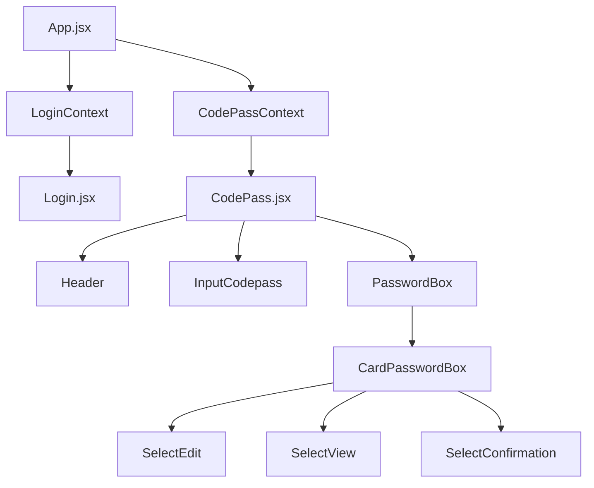

# 🔐 CodePass Extension

**Extensión de navegador para gestión de contraseñas**

[](https://github.com/azanoRivers/codepass-extension)
[](https://reactjs.org/)
[](https://vitejs.dev/)
[](https://tailwindcss.com/)

## 📋 Descripción

CodePass es una extensión de navegador Chrome que proporciona una interfaz moderna y segura para la gestión de contraseñas almacenadas en google drive. Construida con React 18, Vite y TailwindCSS, ofrece una experiencia de usuario fluida y características avanzadas de seguridad.

## ✨ Características Principales

- 🔒 **Gestión Segura de Contraseñas**: Almacenamiento y organización de credenciales
- 🚀 **Interfaz Moderna**: UI construida con React y TailwindCSS
- 🔐 **Sistema de Bloqueo**: Protección adicional con contraseña maestra
- 📱 **Responsive Design**: Adaptable a diferentes tamaños de ventana
- 🎨 **Modo Oscuro**: Interfaz optimizada para trabajar en cualquier momento
- ⚡ **Performance Optimizada**: Construida con Vite para máxima velocidad
- 🔍 **Búsqueda y Filtrado**: Encuentra rápidamente las credenciales que necesitas

## 🏗️ Arquitectura del Proyecto

### 📁 Estructura de Directorios

```
codepass-extension/
├── 📂 public/                 # Archivos públicos de la extensión
│   ├── manifest.json          # Configuración de Chrome Extension
│   ├── background.js          # Service Worker de la extensión
│   └── img/                   # Iconos y recursos gráficos
├── 📂 src/                    # Código fuente principal
│   ├── App.jsx                # Componente raíz de la aplicación
│   ├── AppUi.jsx              # Layout principal de la UI
│   ├── tailwind.css           # Estilos globales de Tailwind
│   └── 📂 assets/             # Recursos y componentes
│       ├── 📂 components/     # Componentes reutilizables
│       ├── 📂 contexts/       # Contextos de React (Estado global)
│       ├── 📂 hooks/          # Custom Hooks
│       ├── 📂 pages/          # Páginas principales
│       └── 📂 utils/          # Utilidades y helpers
├── 📄 vite.config.js          # Configuración de Vite
├── 📄 tailwind.config.js      # Configuración de TailwindCSS
└── 📄 package.json            # Dependencias y scripts
```

### 🧩 Arquitectura de Componentes

#### **🌐 Contextos (Estado Global)**
- **`CodePassContext`**: Estado principal de la aplicación (contraseñas, configuración, modales)
- **`LoginContext`**: Manejo de autenticación y sesión de usuario

#### **🎯 Custom Hooks**
- **`useLogin`**: Gestión de autenticación
- **`useModalLock`**: Control de modal de bloqueo
- **`useModalBlockpass`**: Control de modal de contraseña maestra
- **`useTestRed`**: Verificación de conexión a internet
- **`useCodePassData`**: Acceso a datos de contraseñas
- **`useSetPassblock`**: Configuración de bloqueo de contraseñas
- **`useFilterPass`**: Filtrado y búsqueda de contraseñas
- **`useToolsPassword`**: Herramientas de manipulación de contraseñas
- **`useSyncDrive`**: Sincronización automática con Google Drive
- **`useDataDriveGoogle`**: Recuperación de datos desde Drive al login
- **`useImportPasswords`**: Importación de archivos de passwords (cifrados o planos)

### 🔐 Arquitectura de Seguridad y Encriptación

#### **Claves de Encriptación**

CodePass utiliza un sistema de **doble clave** para máxima seguridad:

**1. `masterKey` (Clave Maestra para Drive)**
- Derivada SOLO de la `blockPhrase` (frase de bloqueo del usuario)
- **Sin timeToken** → Determinista y persistente
- Usada para cifrar/descifrar datos en Google Drive
- Se guarda en `chrome.storage.local` durante la sesión activa
- Se limpia al cerrar sesión o bloquear passwords

**2. `temporalsesionpass` (Clave Temporal de Sesión)**
- Derivada de `blockPhrase + timeToken` (único por sesión)
- **Con timeToken** → No determinista, cambia en cada login
- Usada para cifrar/descifrar passwords localmente
- Se guarda en `chrome.storage.local` durante la sesión
- Se limpia al cerrar sesión o bloquear passwords

**Derivación de Claves (PBKDF2):**
```javascript
// masterKey (sin timeToken)
const masterKey = await deriveMasterKey(blockPhrase);

// temporalsesionpass (con timeToken)
const temporalSessionPass = await deriveMasterKey(blockPhrase, timeToken);
```

**Algoritmos de Encriptación:**
- **PBKDF2**: Derivación de claves (310,000 iteraciones, SHA-256)
- **AES-GCM**: Cifrado simétrico (256 bits)
- **Base64**: Codificación de datos cifrados

#### **Flujos de Sincronización con Drive**

**📤 Sincronización TO Drive (Guardar)**

Triggers automáticos después de:
- Crear nueva password (500ms delay)
- Editar password existente (500ms delay)
- Eliminar password (500ms delay)
- Importar passwords (500ms o 1000ms según caso)
- Establecer/actualizar blockpass

**Proceso de sincronización:**
```javascript
1. Lee passwords cifradas desde chrome.storage.local
2. Descifra con temporalsesionpass
3. Convierte a formato string plano
4. Cifra con masterKey (o envía plano si no hay blockpass)
5. Envía a Drive con formato: <<<cpbh5:ENCRYPTED_DATA>>>
```

**📥 Sincronización FROM Drive (Recuperar)**

Detecta automáticamente al login:
- Archivo sin cifrar → Importa directamente
- Archivo cifrado (`<<<cpbh5:...>>>`) → Solicita blockPhrase con modal

**Proceso de recuperación:**
```javascript
1. Detecta archivo cifrado en Drive
2. Muestra ModalRequired para pedir blockPhrase
3. Deriva masterKey (sin timeToken)
4. Descifra contenido con masterKey
5. Deriva temporalsesionpass (con timeToken)
6. Cifra passwords localmente con temporalsesionpass
7. Guarda en contexto y chrome.storage.local
```

**⚠️ Seguridad Crítica:**
- Si la blockPhrase es incorrecta → **Desloguea usuario automáticamente**
- Evita sobrescribir datos en Drive por error de autenticación

#### **Flujos de Importación/Exportación**

**📥 Importación de Archivos**

**Caso 1: Archivo sin cifrar + Sin blockpass activo**
```javascript
1. Lee archivo .txt plano
2. Transforma a formato passwords
3. Guarda sin cifrar
4. Sincroniza con Drive en formato plano
```

**Caso 2: Archivo sin cifrar + Con blockpass activo**
```javascript
1. Lee archivo .txt plano
2. Transforma a formato passwords
3. Cifra con temporalsesionpass
4. Guarda cifradas
5. Sincroniza con Drive (cifrado con masterKey)
```

**Caso 3: Archivo cifrado + Sin blockpass previo**
```javascript
1. Detecta formato <<<cpbh5:...>>>
2. Muestra ModalRequired para pedir blockPhrase
3. Descifra con masterKey derivada del blockPhrase
4. Crea blockdatapass y guarda masterKey
5. Deriva temporalsesionpass
6. Cifra passwords con temporalsesionpass
7. Guarda y sincroniza con Drive
```

**Caso 4: Archivo cifrado + Con blockpass activo**
```javascript
1. Detecta formato <<<cpbh5:...>>>
2. Muestra ModalRequired
3. Valida que blockPhrase coincida con blockdatapass
4. Descifra, combina con passwords existentes
5. Recifra todo con temporalsesionpass
6. Sincroniza con Drive
```

**📤 Exportación de Archivos**

**Sin bloqueo:**
```javascript
1. Descifra passwords (si están cifradas localmente)
2. Convierte a formato string plano
3. Exporta como .txt sin cifrar
```

**Con bloqueo:**
```javascript
1. Solicita blockPhrase al usuario
2. Descifra passwords locales con temporalsesionpass
3. Cifra con masterKey derivada de blockPhrase
4. Exporta con formato: <<<cpbh5:ENCRYPTED_DATA>>>
```

#### **Gestión de Estados de Bloqueo**

**Estados en chrome.storage.local:**
- `blockdatapass`: BlockPhrase cifrada consigo misma
- `masterkey`: Clave para Drive (activa solo durante sesión)
- `temporalsesionpass`: Clave local (activa solo durante sesión)
- `manualunblockpass`: Flag de desbloqueo manual (sin blockpass)

**Bloqueo de Passwords:**
```javascript
// Al bloquear
chrome.storage.local.remove('temporalsesionpass');
chrome.storage.local.remove('masterkey');

// Al desbloquear
const temporalSessionPass = await deriveMasterKey(blockPhrase, timeToken);
const masterKey = await deriveMasterKey(blockPhrase);
chrome.storage.local.set({ temporalsesionpass: temporalSessionPass });
chrome.storage.local.set({ masterkey: masterKey });
```

**Limpieza al Logout:**
```javascript
chrome.storage.local.remove('accountToken');
chrome.storage.local.remove('timeToken');
chrome.storage.local.remove('codepassdata');
chrome.storage.local.remove('blockdatapass');
chrome.storage.local.remove('temporalsesionpass');
chrome.storage.local.remove('masterkey');
```

#### **📋 Checklist de Seguridad**

✅ **MasterKey nunca se almacena permanentemente** (solo durante sesión activa)  
✅ **Passwords locales cifradas con temporalsesionpass** (cambia por sesión)  
✅ **Drive cifrado con masterKey** (determinista para lectura/escritura)  
✅ **BlockPhrase nunca se guarda en texto plano**  
✅ **Logout automático si falla descifrado de Drive**  
✅ **Limpieza completa de claves al cerrar sesión**  

#### **📄 Páginas Principales**
- **`Login.jsx`**: Página de autenticación
- **`CodePass.jsx`**: Dashboard principal de gestión de contraseñas

#### **🔧 Componentes Clave**

**Componentes de UI:**
- **`Header`**: Encabezado con información de usuario
- **`Footer`**: Pie de página con información adicional
- **`ModalGeneric`**: Modal reutilizable para diferentes propósitos
- **`ButtonGeneric`**: Botón personalizable
- **`InputGeneric`**: Input con validaciones y estilos personalizados

**Componentes de Funcionalidad:**
- **`PasswordBox`**: Contenedor principal de contraseñas
- **`CardPasswordBox`**: Tarjeta individual de contraseña
- **`InputCodepass`**: Input principal para buscar/filtrar
- **`SelectEdit`**: Componente para editar contraseñas
- **`SelectView`**: Componente para visualizar contraseñas
- **`SelectConfirmation`**: Confirmación de acciones críticas

**Componentes de Autenticación:**
- **`LoginGoogle`**: Botón de login con Google
- **`UserAccount`**: Información de cuenta de usuario
- **`LogoutButton`**: Botón de cerrar sesión

**Iconografía:**
- **`IconRobotX`**, **`IconRobotHappy`**, **`IconRobotWh`**: Iconos de estado
- **`IconEye`**, **`IconEdit`**, **`IconLock`**, **`IconTrash`**: Iconos de acciones
- **`IconSearch`**, **`IconMenuPoints`**, **`IconRandom`**: Iconos de herramientas

### 🔄 Flujo de Datos



## 🛠️ Tecnologías Utilizadas

### **Frontend Framework**
- **React 18.3.1**: Framework principal para la UI
- **React DOM 18.3.1**: Renderizado en el DOM
- **PropTypes 15.8.1**: Validación de tipos de props

### **Herramientas de Desarrollo**
- **Vite 5.3.1**: Build tool y bundler ultra-rápido
- **ESLint 8.57.0**: Linting de código
- **Autoprefixer 10.4.19**: Prefijos CSS automáticos

### **Estilos y UI**
- **TailwindCSS 3.4.4**: Framework de CSS utility-first
- **PostCSS 8.4.38**: Procesador de CSS (necesario para tailwind <4)
- **React Hot Toast 2.5.2**: Notificaciones toast

### **Chrome Extension**
- **Manifest V3**: Última versión del sistema de extensiones
- **Service Worker**: Background script para funcionalidad offline
- **Storage API**: Almacenamiento local seguro

## 🚀 Instalación y Desarrollo

### **Prerrequisitos**
- Node.js 16+ 
- npm o yarn
- Google Chrome (para testing)

### **Configuración del Entorno**

1. **Clonar el repositorio**
```bash
git clone https://github.com/azanoRivers/codepass-extension.git
cd codepass-extension
```

2. **Instalar dependencias**
```bash
npm install
```

3. **Configurar variables de entorno**
- Este proyecto no usa variables de entorno, solo se usa el id del proyecto de google en el background.js

### **Scripts de Desarrollo**

```bash
# Modo desarrollo con hot reload
npm run dev

# Build para producción
npm run build

# Build con auto-recompilación (ideal para desarrollo de extensiones)
npm run build-watch

# Linting del código
npm run lint

# Preview del build
npm run preview
```

### **Instalación en Chrome**

1. Ejecutar `npm run build` (o `npm run build-watch` para auto-recompilación)
2. Abrir Chrome y navegar a `chrome://extensions/`
3. Habilitar "Modo de desarrollador"
4. Clic en "Cargar extensión sin empaquetar"
5. Seleccionar la carpeta `dist/`

**💡 Tip**: Usa `npm run build-watch` durante el desarrollo para que la extensión se recompile automáticamente al guardar cambios.

## 📝 Configuración

### **Manifest.json**
```json
{
  "manifest_version": 3,
  "name": "CodePass",
  "version": "1.0",
  "description": "Gestión de passwords para CodeLabs",
  "permissions": [
    "scripting",
    "storage", 
    "cookies",
    "identity",
    "activeTab"
  ]
}
```

### **Vite Configuration**
El proyecto utiliza aliases para imports limpos:
- `@components/*` → `src/assets/components/*`
- `@hooks/*` → `src/assets/hooks/*`
- `@contexts/*` → `src/assets/contexts/*`
- `@pages/*` → `src/assets/pages/*`
- `@utils/*` → `src/assets/utils/*`
- `@icons/*` → `src/assets/components/icons/*`

**Características adicionales:**
- **Build Watch**: Configurado para auto-recompilación durante el desarrollo
- **Mensajes de build**: Notificaciones informativas durante la compilación

## 🔒 Seguridad

- **Almacenamiento Encriptado**: Las contraseñas se almacenan de forma segura
- **Autenticación OAuth**: Integración con Google OAuth
- **Validación de Entrada**: Sanitización de todos los inputs
- **CSP (Content Security Policy)**: Configurado para máxima seguridad
- **Permissions Mínimas**: Solo los permisos necesarios para funcionar

## 📄 Licencia

Este proyecto está bajo la Licencia MIT. Ver `LICENSE` para más detalles.

## 👥 Equipo

Desarrollado por **AzanoRivers - Andrés Rivera** con ❤️

---