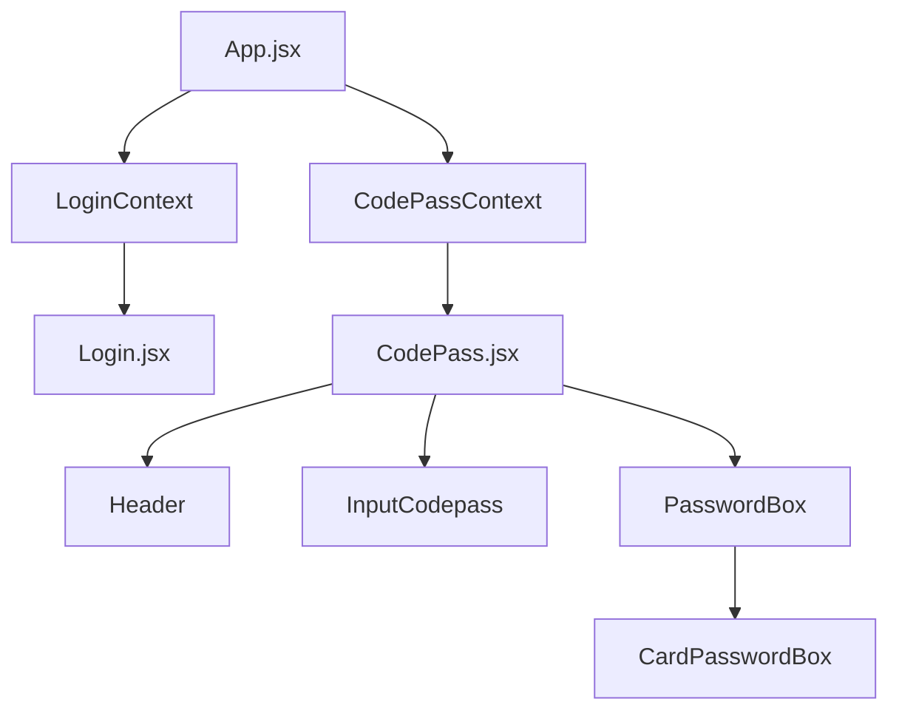

# 🔐 CodePass Extension

**Extensión de navegador para gestión de contraseñas** | **Browser extension for password management**

[](https://github.com/azanoRivers/codepass-extension)
[](https://reactjs.org/)
[](https://vitejs.dev/)
[](https://tailwindcss.com/)
[](#-licencia--license)

---

### 🌐 Language / Idioma

**[🇪🇸 Español](#español)** | **[🇬🇧 English](#english)**

---

<a name="español"></a>
## 🇪🇸 ESPAÑOL

## 📋 Descripción

CodePass es una extensión de navegador Chrome que proporciona una interfaz moderna y segura para la gestión de contraseñas almacenadas en google drive (no se almacenan datos en servidores externos). Construida con React 18, Vite y TailwindCSS, ofrece una experiencia de usuario fluida, moderna, minimalista y características de seguridad eficaces.

## ✨ Características Principales

- 🔒 **Gestión Segura de Contraseñas**: Almacenamiento y organización de credenciales
- 🚀 **Interfaz Moderna**: UI construida con React y TailwindCSS. Diseño de UI by AzanoLabs / AzanoRivers.
- 🔐 **Sistema de Bloqueo**: Protección adicional con contraseña maestra
- 📱 **Responsive Design**: Adaptable a diferentes tamaños de ventana
- 🎨 **Modo Oscuro**: Interfaz optimizada para trabajar en cualquier momento
- ⚡ **Performance Optimizada**: Construida con Vite para máxima velocidad
- 🔍 **Búsqueda y Filtrado**: Encuentra rápidamente las credenciales que necesitas

## 🏗️ Arquitectura del Proyecto

### 📁 Estructura de Directorios

```
codepass-extension/
├── 📂 public/                 # Archivos públicos de la extensión
│   ├── manifest.json          # Configuración de Chrome Extension
│   ├── background.js          # Service Worker de la extensión
│   └── img/                   # Iconos y recursos gráficos
├── 📂 src/                    # Código fuente principal
│   ├── App.jsx                # Componente raíz de la aplicación
│   ├── AppUi.jsx              # Layout principal de la UI
│   ├── tailwind.css           # Estilos globales de Tailwind
│   └── 📂 assets/             # Recursos y componentes
│       ├── 📂 components/     # Componentes reutilizables
│       ├── 📂 contexts/       # Contextos de React (Estado global)
│       ├── 📂 hooks/          # Custom Hooks
│       ├── 📂 pages/          # Páginas principales
│       └── 📂 utils/          # Utilidades y helpers
├── 📄 vite.config.js          # Configuración de Vite
├── 📄 tailwind.config.js      # Configuración de TailwindCSS
└── 📄 package.json            # Dependencias y scripts
```

### 🧩 Arquitectura de Componentes

#### **🌐 Contextos (Estado Global)**
- **`CodePassContext`**: Estado principal de la aplicación (contraseñas, configuración, modales)
- **`LoginContext`**: Manejo de autenticación y sesión de usuario

#### **🎯 Custom Hooks**
- **`useLogin`**: Gestión de autenticación
- **`useModalLock`**: Control de modal de bloqueo
- **`useModalBlockpass`**: Control de modal de contraseña maestra
- **`useTestRed`**: Verificación de conexión a internet usando `navigator.onLine` (sin peticiones HTTP externas)
- **`useCodePassData`**: Acceso a datos de contraseñas
- **`useSetPassblock`**: Configuración de bloqueo de contraseñas
- **`useFilterPass`**: Filtrado y búsqueda de contraseñas
- **`useToolsPassword`**: Herramientas de manipulación de contraseñas
- **`useSyncDrive`**: Sincronización automática con Google Drive
- **`useDataDriveGoogle`**: Recuperación de datos desde Drive al login
- **`useImportPasswords`**: Importación de archivos de passwords (cifrados o planos)

### 🔐 Arquitectura de Seguridad y Encriptación

#### **Claves de Encriptación**

CodePass utiliza un sistema de **doble clave** para máxima seguridad:

**1. `masterKey` (Clave Maestra para Drive)**
- Derivada SOLO de la `blockPhrase` (frase de bloqueo del usuario)
- **Sin timeToken** → Determinista y persistente
- Usada para cifrar/descifrar datos en Google Drive
- Se guarda en `chrome.storage.local` durante la sesión activa
- Se limpia al cerrar sesión o bloquear passwords

**2. `temporalsesionpass` (Clave Temporal de Sesión)**
- Derivada de `blockPhrase + timeToken` (único por sesión)
- **Con timeToken** → No determinista, cambia en cada login
- Usada para cifrar/descifrar passwords localmente
- Se guarda en `chrome.storage.local` durante la sesión
- Se limpia al cerrar sesión o bloquear passwords

**Derivación de Claves (PBKDF2):**
```javascript
// masterKey (sin timeToken)
const masterKey = await deriveMasterKey(blockPhrase);

// temporalsesionpass (con timeToken)
const temporalSessionPass = await deriveMasterKey(blockPhrase, timeToken);
```

**Algoritmos de Encriptación:**
- **PBKDF2**: Derivación de claves (310,000 iteraciones, SHA-256)
- **AES-GCM**: Cifrado simétrico (256 bits)
- **Base64**: Codificación de datos cifrados

#### **Flujos de Sincronización con Drive**

**📤 Sincronización TO Drive (Guardar)**

Triggers automáticos después de:
- Crear nueva password (500ms delay)
- Editar password existente (500ms delay)
- Eliminar password (500ms delay)
- Importar passwords (500ms o 1000ms según caso)
- Establecer/actualizar blockpass

**Proceso de sincronización:**
```javascript
1. Lee passwords cifradas desde chrome.storage.local
2. Descifra con temporalsesionpass
3. Convierte a formato string plano
4. Cifra con masterKey (o envía plano si no hay blockpass)
5. Envía a Drive con formato: <<<cpbh5:ENCRYPTED_DATA>>>
```

**📥 Sincronización FROM Drive (Recuperar)**

Detecta automáticamente al login:
- Archivo sin cifrar → Importa directamente
- Archivo cifrado (`<<<cpbh5:...>>>`) → Solicita blockPhrase con modal

**Proceso de recuperación:**
```javascript
1. Detecta archivo cifrado en Drive
2. Muestra ModalRequired para pedir blockPhrase
3. Deriva masterKey (sin timeToken)
4. Descifra contenido con masterKey
5. Deriva temporalsesionpass (con timeToken)
6. Cifra passwords localmente con temporalsesionpass
7. Guarda en contexto y chrome.storage.local
```

**⚠️ Seguridad Crítica:**
- Si la blockPhrase es incorrecta → **Desloguea usuario automáticamente**
- Evita sobrescribir datos en Drive por error de autenticación

#### **Flujos de Importación/Exportación**

**📥 Importación de Archivos**

**Caso 1: Archivo sin cifrar + Sin blockpass activo**
```javascript
1. Lee archivo .txt plano
2. Transforma a formato passwords
3. Guarda sin cifrar
4. Sincroniza con Drive en formato plano
```

**Caso 2: Archivo sin cifrar + Con blockpass activo**
```javascript
1. Lee archivo .txt plano
2. Transforma a formato passwords
3. Cifra con temporalsesionpass
4. Guarda cifradas
5. Sincroniza con Drive (cifrado con masterKey)
```

**Caso 3: Archivo cifrado + Sin blockpass previo**
```javascript
1. Detecta formato <<<cpbh5:...>>>
2. Muestra ModalRequired para pedir blockPhrase
3. Descifra con masterKey derivada del blockPhrase
4. Crea blockdatapass y guarda masterKey
5. Deriva temporalsesionpass
6. Cifra passwords con temporalsesionpass
7. Guarda y sincroniza con Drive
```

**Caso 4: Archivo cifrado + Con blockpass activo**
```javascript
1. Detecta formato <<<cpbh5:...>>>
2. Muestra ModalRequired
3. Valida que blockPhrase coincida con blockdatapass
4. Descifra, combina con passwords existentes
5. Recifra todo con temporalsesionpass
6. Sincroniza con Drive
```

**📤 Exportación de Archivos**

**Sin bloqueo:**
```javascript
1. Descifra passwords (si están cifradas localmente)
2. Convierte a formato string plano
3. Exporta como .txt sin cifrar
```

**Con bloqueo:**
```javascript
1. Solicita blockPhrase al usuario
2. Descifra passwords locales con temporalsesionpass
3. Cifra con masterKey derivada de blockPhrase
4. Exporta con formato: <<<cpbh5:ENCRYPTED_DATA>>>
```

#### **Gestión de Estados de Bloqueo**

**Estados en chrome.storage.local:**
- `blockdatapass`: BlockPhrase cifrada consigo misma
- `masterkey`: Clave para Drive (activa solo durante sesión)
- `temporalsesionpass`: Clave local (activa solo durante sesión)
- `manualunblockpass`: Flag de desbloqueo manual (sin blockpass)

**Bloqueo de Passwords:**
```javascript
// Al bloquear
chrome.storage.local.remove('temporalsesionpass');
chrome.storage.local.remove('masterkey');

// Al desbloquear
const temporalSessionPass = await deriveMasterKey(blockPhrase, timeToken);
const masterKey = await deriveMasterKey(blockPhrase);
chrome.storage.local.set({ temporalsesionpass: temporalSessionPass });
chrome.storage.local.set({ masterkey: masterKey });
```

**Limpieza al Logout:**
```javascript
chrome.storage.local.remove('accountToken');
chrome.storage.local.remove('timeToken');
chrome.storage.local.remove('codepassdata');
chrome.storage.local.remove('blockdatapass');
chrome.storage.local.remove('temporalsesionpass');
chrome.storage.local.remove('masterkey');
```

#### **📋 Checklist de Seguridad**

✅ **MasterKey nunca se almacena permanentemente** (solo durante sesión activa)  
✅ **Passwords locales cifradas con temporalsesionpass** (cambia por sesión)  
✅ **Drive cifrado con masterKey** (determinista para lectura/escritura)  
✅ **BlockPhrase nunca se guarda en texto plano**  
✅ **Logout automático si falla descifrado de Drive**  
✅ **Limpieza completa de claves al cerrar sesión**  

#### **📄 Páginas Principales**
- **`Login.jsx`**: Página de autenticación
- **`CodePass.jsx`**: Dashboard principal de gestión de contraseñas

#### **🔧 Componentes Clave**

**Componentes de UI:**
- **`Header`**: Encabezado con información de usuario
- **`Footer`**: Pie de página con información adicional
- **`ModalGeneric`**: Modal reutilizable para diferentes propósitos
- **`ButtonGeneric`**: Botón personalizable
- **`InputGeneric`**: Input con validaciones y estilos personalizados

**Componentes de Funcionalidad:**
- **`PasswordBox`**: Contenedor principal de contraseñas
- **`CardPasswordBox`**: Tarjeta individual de contraseña
- **`InputCodepass`**: Input principal para buscar/filtrar
- **`SelectEdit`**: Componente para editar contraseñas
- **`SelectView`**: Componente para visualizar contraseñas
- **`SelectConfirmation`**: Confirmación de acciones críticas

**Componentes de Autenticación:**
- **`LoginGoogle`**: Botón de login con Google
- **`UserAccount`**: Información de cuenta de usuario
- **`LogoutButton`**: Botón de cerrar sesión

**Iconografía:**
- **`IconRobotX`**, **`IconRobotHappy`**, **`IconRobotWh`**: Iconos de estado
- **`IconEye`**, **`IconEdit`**, **`IconLock`**, **`IconTrash`**: Iconos de acciones
- **`IconSearch`**, **`IconMenuPoints`**, **`IconRandom`**: Iconos de herramientas

### 🔄 Flujo de Datos


## 🛠️ Tecnologías Utilizadas

### **Frontend Framework**
- **React 18.3.1**: Framework principal para la UI
- **React DOM 18.3.1**: Renderizado en el DOM
- **PropTypes 15.8.1**: Validación de tipos de props

### **Herramientas de Desarrollo**
- **Vite 5.3.1**: Build tool y bundler ultra-rápido
- **ESLint 8.57.0**: Linting de código
- **Autoprefixer 10.4.19**: Prefijos CSS automáticos

### **Estilos y UI**
- **TailwindCSS 3.4.4**: Framework de CSS utility-first
- **PostCSS 8.4.38**: Procesador de CSS (necesario para tailwind <4)
- **React Hot Toast 2.5.2**: Notificaciones toast

### **Chrome Extension**
- **Manifest V3**: Última versión del sistema de extensiones
- **Service Worker**: Background script para funcionalidad offline
- **Storage API**: Almacenamiento local seguro

## 🚀 Instalación y Desarrollo

### **Prerrequisitos**
- Node.js 16+ 
- npm o yarn
- Google Chrome (para testing)

### **Configuración del Entorno**

1. **Clonar el repositorio**
```bash
git clone https://github.com/azanoRivers/codepass-extension.git
cd codepass-extension
```

2. **Instalar dependencias**
```bash
npm install
```

3. **Configurar variables de entorno**
- Este proyecto no usa variables de entorno, solo se usa el id del proyecto de google en el background.js

### **Scripts de Desarrollo**

```bash
# Modo desarrollo con hot reload
npm run dev

# Build para producción
npm run build

# Build con auto-recompilación (ideal para desarrollo de extensiones)
npm run build-watch

# Linting del código
npm run lint

# Preview del build
npm run preview
```

### **Instalación en Chrome**

1. Ejecutar `npm run build` (o `npm run build-watch` para auto-recompilación)
2. Abrir Chrome y navegar a `chrome://extensions/`
3. Habilitar "Modo de desarrollador"
4. Clic en "Cargar extensión sin empaquetar"
5. Seleccionar la carpeta `dist/`

**💡 Tip**: Usa `npm run build-watch` durante el desarrollo para que la extensión se recompile automáticamente al guardar cambios.

## 📝 Configuración

### **Manifest.json**
```json
{
  "manifest_version": 3,
  "name": "CodePass",
  "version": "1.0",
  "description": "Simple and modern password management",
  "permissions": [
    "storage",
    "identity"
  ]
}
```

**Permisos Mínimos:**
- ✅ **`storage`**: Almacenamiento local de tokens y datos cifrados
- ✅ **`identity`**: Autenticación OAuth con Google
- ❌ **`scripting`**: Removido (no se inyecta código en páginas web)
- ❌ **`cookies`**: Removido (no se accede a cookies)
- ❌ **`activeTab`**: Removido (no se interactúa con contenido de pestañas)
- ❌ **`host_permissions`**: Removido (no se accede a contenido de páginas web)

### **Vite Configuration**
El proyecto utiliza aliases para imports limpos:
- `@components/*` → `src/assets/components/*`
- `@hooks/*` → `src/assets/hooks/*`
- `@contexts/*` → `src/assets/contexts/*`
- `@pages/*` → `src/assets/pages/*`
- `@utils/*` → `src/assets/utils/*`
- `@icons/*` → `src/assets/components/icons/*`

**Características adicionales:**
- **Build Watch**: Configurado para auto-recompilación durante el desarrollo
- **Mensajes de build**: Notificaciones informativas durante la compilación

## 🔒 Seguridad

- **Almacenamiento Encriptado**: Las contraseñas se almacenan de forma segura con AES-GCM 256-bit
- **Derivación de Claves PBKDF2**: 310,000 iteraciones con SHA-256
- **Autenticación OAuth**: Integración con Google OAuth
- **Validación de Entrada**: Sanitización de todos los inputs
- **CSP (Content Security Policy)**: Configurado para máxima seguridad
- **Permisos Mínimos**: Solo `storage` e `identity` - sin acceso a contenido de páginas web
- **Sin Peticiones Externas**: Verificación de conexión mediante `navigator.onLine` nativo

## 📄 Licencia

**Licencia Personalizada de Uso Educativo y No Comercial**

Este software es de código abierto con las siguientes condiciones:

### ✅ Permitido:
- ✅ Uso personal y educativo gratuito
- ✅ Estudiar, aprender y modificar el código
- ✅ Distribuir versiones modificadas (forks) con crédito al autor original
- ✅ Contribuir con mejoras mediante Pull Requests

### ❌ Prohibido:
- ❌ Uso comercial directo (vender la extensión tal cual)
- ❌ Uso comercial con modificaciones mínimas (copia con cambios superficiales)
- ❌ Distribución con intenciones maliciosas (malware, phishing, etc.)
- ❌ Eliminar o modificar los créditos del autor original

**Nota Legal:** Cualquier distribución debe mantener esta licencia y dar crédito a **AzanoRivers / Andrés Rivera** como autor original. El uso comercial requiere autorización expresa del autor.

Para solicitudes comerciales, contactar a: [GitHub @AzanoRivers](https://github.com/AzanoRivers)

## 👥 Equipo

Desarrollado por **AzanoRivers - Andrés Rivera** con ❤️

---

<a name="english"></a>
## 🇬🇧 ENGLISH

## 📋 Description

CodePass is a Chrome browser extension that provides a modern and secure interface for password management stored in Google Drive (no data is stored on external servers). Built with React 18, Vite and TailwindCSS, it offers a fluid, modern, minimalist user experience with effective security features.

## ✨ Main Features

- 🔒 **Secure Password Management**: Storage and organization of credentials
- 🚀 **Modern Interface**: UI built with React and TailwindCSS. UI Design by AzanoLabs / AzanoRivers.
- 🔐 **Lock System**: Additional protection with master password
- 📱 **Responsive Design**: Adaptable to different window sizes
- 🎨 **Dark Mode**: Optimized interface for working at any time
- ⚡ **Optimized Performance**: Built with Vite for maximum speed
- 🔍 **Search and Filter**: Quickly find the credentials you need

## 🏗️ Project Architecture

### 📁 Directory Structure

```
codepass-extension/
├── 📂 public/                 # Public extension files
│   ├── manifest.json          # Chrome Extension configuration
│   ├── background.js          # Extension Service Worker
│   └── img/                   # Icons and graphic resources
├── 📂 src/                    # Main source code
│   ├── App.jsx                # Application root component
│   ├── AppUi.jsx              # Main UI Layout
│   ├── tailwind.css           # Global Tailwind styles
│   └── 📂 assets/             # Resources and components
│       ├── 📂 components/     # Reusable components
│       ├── 📂 contexts/       # React Contexts (Global state)
│       ├── 📂 hooks/          # Custom Hooks
│       ├── 📂 pages/          # Main pages
│       └── 📂 utils/          # Utilities and helpers
├── 📄 vite.config.js          # Vite configuration
├── 📄 tailwind.config.js      # TailwindCSS configuration
└── 📄 package.json            # Dependencies and scripts
```

### 🧩 Component Architecture

#### **🌐 Contexts (Global State)**
- **`CodePassContext`**: Main application state (passwords, configuration, modals)
- **`LoginContext`**: User authentication and session management

#### **🎯 Custom Hooks**
- **`useLogin`**: Authentication management
- **`useModalLock`**: Lock modal control
- **`useTestRed`**: Internet connection verification using `navigator.onLine` (no external HTTP requests)
- **`useCodePassData`**: Password data access
- **`useSetPassblock`**: Password lock configuration
- **`useToolsPassword`**: Password manipulation tools
- **`useSyncDrive`**: Automatic Google Drive synchronization
- **`useDataDriveGoogle`**: Drive data retrieval on login
- **`useImportPasswords`**: Password file import (encrypted or plain)

#### **📄 Main Pages**
- **`Login.jsx`**: Authentication page
- **`CodePass.jsx`**: Main password management dashboard

#### **🔧 Key Components**

**UI Components:**
- **`Header`**: Header with user information
- **`Footer`**: Footer with additional information
- **`ModalGeneric`**: Reusable modal for different purposes
- **`ButtonGeneric`**: Customizable button
- **`InputGeneric`**: Input with validations and custom styles

**Functionality Components:**
- **`PasswordBox`**: Main password container
- **`CardPasswordBox`**: Individual password card
- **`InputCodepass`**: Main input for search/filter
- **`LoginGoogle`**: Google login button
- **`UserAccount`**: User account information
- **`LogoutButton`**: Logout button

**Icons:**
- **`IconRobotX`**, **`IconRobotHappy`**, **`IconRobotWh`**: Status icons
- **`IconEye`**, **`IconEdit`**, **`IconLock`**, **`IconTrash`**: Action icons
- **`IconSearch`**, **`IconMenuPoints`**, **`IconRandom`**: Tool icons

### 🔄 Data Flow



## 🔐 Security and Encryption Architecture

### **Encryption Keys**

CodePass uses a **dual-key system** for maximum security:

**1. `masterKey` (Master Key for Drive)**
- Derived ONLY from the `blockPhrase` (user's lock phrase)
- **Without timeToken** → Deterministic and persistent
- Used to encrypt/decrypt data in Google Drive
- Stored in `chrome.storage.local` during active session
- Cleaned on logout or password lock

**2. `temporalsesionpass` (Temporary Session Key)**
- Derived from `blockPhrase + timeToken` (unique per session)
- **With timeToken** → Non-deterministic, changes every login
- Used to encrypt/decrypt passwords locally
- Stored in `chrome.storage.local` during session
- Cleaned on logout or password lock

**Key Derivation (PBKDF2):**
```javascript
// masterKey (without timeToken)
const masterKey = await deriveMasterKey(blockPhrase);

// temporalsesionpass (with timeToken)
const temporalSessionPass = await deriveMasterKey(blockPhrase, timeToken);
```

**Encryption Algorithms:**
- **PBKDF2**: Key derivation (310,000 iterations, SHA-256)
- **AES-GCM**: Symmetric encryption (256 bits)
- **Base64**: Encrypted data encoding

### **Drive Synchronization Flows**

**📤 TO Drive (Save)**

Automatic triggers after:
- Create new password (500ms delay)
- Edit existing password (500ms delay)
- Delete password (500ms delay)
- Import passwords (500ms or 1000ms depending on case)
- Set/update blockpass

**Synchronization process:**
```javascript
1. Read encrypted passwords from chrome.storage.local
2. Decrypt with temporalsesionpass
3. Convert to plain string format
4. Encrypt with masterKey (or send plain if no blockpass)
5. Send to Drive with format: <<<cpbh5:ENCRYPTED_DATA>>>
```

**📥 FROM Drive (Retrieve)**

Automatic detection on login:
- Plain file → Import directly
- Encrypted file (`<<<cpbh5:...>>>`) → Request blockPhrase with modal

**Recovery process:**
```javascript
1. Detect encrypted file in Drive
2. Show ModalRequired to request blockPhrase
3. Derive masterKey (without timeToken)
4. Decrypt content with masterKey
5. Derive temporalsesionpass (with timeToken)
6. Encrypt passwords locally with temporalsesionpass
7. Save in context and chrome.storage.local
```

**⚠️ Critical Security:**
- Incorrect blockPhrase → **Automatic user logout**
- Prevents overwriting Drive data due to authentication error

### **Import/Export Flows**

**📥 Import**

**Case 1: Plain file + No active blockpass**
```javascript
1. Read plain .txt file
2. Transform to password format
3. Save unencrypted
4. Sync with Drive in plain format
```

**Case 2: Plain file + Active blockpass**
```javascript
1. Read plain .txt file
2. Transform to password format
3. Encrypt with temporalsesionpass
4. Save encrypted
5. Sync with Drive (encrypted with masterKey)
```

**Case 3: Encrypted file + No previous blockpass**
```javascript
1. Detect <<<cpbh5:...>>> format
2. Show ModalRequired to request blockPhrase
3. Decrypt with masterKey derived from blockPhrase
4. Create blockdatapass and save masterKey
5. Derive temporalsesionpass
6. Encrypt passwords with temporalsesionpass
7. Save and sync with Drive
```

**Case 4: Encrypted file + Active blockpass**
```javascript
1. Detect <<<cpbh5:...>>> format
2. Show ModalRequired
3. Validate blockPhrase matches blockdatapass
4. Decrypt, combine with existing passwords
5. Re-encrypt everything with temporalsesionpass
6. Sync with Drive
```

**📤 Export**

**Without lock:**
```javascript
1. Decrypt passwords (if locally encrypted)
2. Convert to plain string format
3. Export as .txt unencrypted
```

**With lock:**
```javascript
1. Request blockPhrase from user
2. Decrypt local passwords with temporalsesionpass
3. Encrypt with masterKey derived from blockPhrase
4. Export with format: <<<cpbh5:ENCRYPTED_DATA>>>
```

### **Lock State Management**

**States in chrome.storage.local:**
- `blockdatapass`: BlockPhrase encrypted with itself
- `masterkey`: Key for Drive (active only during session)
- `temporalsesionpass`: Local key (active only during session)
- `manualunblockpass`: Manual unlock flag (without blockpass)

**Password Lock:**
```javascript
// On lock
chrome.storage.local.remove('temporalsesionpass');
chrome.storage.local.remove('masterkey');

// On unlock
const temporalSessionPass = await deriveMasterKey(blockPhrase, timeToken);
const masterKey = await deriveMasterKey(blockPhrase);
chrome.storage.local.set({ temporalsesionpass: temporalSessionPass });
chrome.storage.local.set({ masterkey: masterKey });
```

**Cleanup on Logout:**
```javascript
chrome.storage.local.remove('accountToken');
chrome.storage.local.remove('timeToken');
chrome.storage.local.remove('codepassdata');
chrome.storage.local.remove('blockdatapass');
chrome.storage.local.remove('temporalsesionpass');
chrome.storage.local.remove('masterkey');
```

### **📋 Security Checklist**

✅ **MasterKey never stored permanently** (only during active session)  
✅ **Local passwords encrypted with temporalsesionpass** (changes per session)  
✅ **Drive encrypted with masterKey** (deterministic for read/write)  
✅ **BlockPhrase never saved in plain text**  
✅ **Automatic logout if Drive decryption fails**  
✅ **Complete key cleanup on session close**

## 🚀 Installation and Development

### **Prerequisites**
- Node.js 16+ 
- npm or yarn
- Google Chrome (for testing)

### **Environment Setup**

```bash
# Clone repository
git clone https://github.com/azanoRivers/codepass-extension.git
cd codepass-extension

# Install dependencies
npm install

# Development with hot reload
npm run dev

# Production build
npm run build

# Build with auto-recompilation
npm run build-watch
```

### **Install in Chrome**

1. Run `npm run build`
2. Open Chrome → `chrome://extensions/`
3. Enable "Developer mode"
4. Click "Load unpacked"
5. Select `dist/` folder

## 🔒 Security

- **Encrypted Storage**: Passwords stored securely with AES-GCM 256-bit
- **PBKDF2 Key Derivation**: 310,000 iterations with SHA-256
- **OAuth Authentication**: Google OAuth integration
- **Input Validation**: Sanitization of all inputs
- **Minimal Permissions**: Only `storage` and `identity` - no access to web page content
- **No External Requests**: Connection verification using native `navigator.onLine`
- **CSP (Content Security Policy)**: Configured for maximum security

## 📄 License

**Custom Educational and Non-Commercial Use License**

This software is open source with the following conditions:

### ✅ Allowed:
- ✅ Free personal and educational use
- ✅ Study, learn and modify the code
- ✅ Distribute modified versions (forks) with credit to the original author
- ✅ Contribute improvements via Pull Requests

### ❌ Prohibited:
- ❌ Direct commercial use (selling the extension as-is)
- ❌ Commercial use with minimal modifications (copy with superficial changes)
- ❌ Distribution with malicious intent (malware, phishing, etc.)
- ❌ Remove or modify the original author's credits

**Legal Notice:** Any distribution must maintain this license and credit **AzanoRivers / Andrés Rivera** as the original author. Commercial use requires express authorization from the author.

For commercial inquiries, contact: [GitHub @AzanoRivers](https://github.com/AzanoRivers)

## 👥 Team

Developed by **AzanoRivers - Andrés Rivera** with ❤️

---